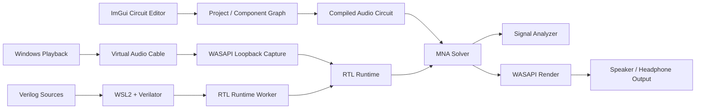

**English** | [한국어](README_KR.md) | [日本語](README_JP.md)

# Audio Circuit Simulator

> **A real-time audio circuit simulator combining physics-based MNA analysis, real-time Windows audio routing, and Verilog/RTL components.**


**Audio Circuit Simulator** is a desktop circuit simulation environment that lets you visually construct audio signal paths and pass real audio through those circuits in real time.

This project combines three areas that are usually separated into different tools:

- Visual circuit editor
- Physics-based audio/electrical circuit solver
- Verilog/RTL development and runtime environment

It is more than a schematic viewer. The application can capture Windows playback audio, pass it through a Verilog DAC model, solve the connected analog circuit at audio sample rate, and drive speaker/headphone load models. At the same time, it can display real-time measurements such as RMS, FFT, THD, THD+N, SNR, DC offset, power, temperature, and frequency response.

---

## Key Features

### Real-Time Physical Circuit Simulation

The analog engine is based on **Modified Nodal Analysis (MNA)** and supports DC, transient, and AC response calculations.

Implemented electrical models include:

- Resistors with tolerance and thermal-noise effects
- Potentiometers
- Capacitors with ESR, leakage, and rated-voltage parameters
- Inductors with DCR and saturation-current parameters
- Silicon diodes
- Nonlinear NPN and PNP BJT models
- Operational amplifiers
- DC, AC, and pulse sources
- Stereo speaker/transducer loads
- Analog ground and return paths

For nonlinear circuits, the solver performs Newton iterations while tracking convergence, residual error, nonlinear substeps, and components associated with failures.

The real-time processing path also performs exact reduction of resistor-only internal nodes. This reduces the matrix size that must be solved for every sample while preserving the full node-voltage results.

### Windows Audio Processing Through the Simulated Circuit


The application includes a dedicated **WASAPI capture/process/render bridge**.

A typical signal flow is:

```text
Windows playback
      │
      ▼
Virtual Audio Cable
      │  WASAPI loopback capture
      ▼
Audio Circuit Simulator
      │
      ├─ RTL / DAC processing
      ├─ physical MNA circuit processing
      └─ live signal analysis
      │
      ▼
Selected Windows output device
      │
      ▼
Speakers / headphones
```

The bridge uses 48 kHz stereo floating-point audio, event-driven WASAPI shared-mode streams, buffering, sequence tracking, underrun/drop statistics, and output-endpoint monitoring.

When routing is enabled, the application temporarily switches Windows playback output to a virtual audio cable and restores the previous default output device when processing stops.

### Verilog / RTL Components


Digital components can be implemented as Verilog modules instead of fixed software models.

The integrated RTL workspace provides:

- Multi-file Verilog source editing
- Top-module selection
- Source analysis
- Verilator builds
- Testbench execution
- Build/analysis diagnostics
- Testbench PASS / FAIL / TIMEOUT summaries
- VCD waveform generation and opening
- Automatic runtime-pin generation from HDL ports
- Import/export of reusable RTL components
- Packaging of executable runtime artifacts even when editable source is unavailable

On Windows, RTL compilation is executed through **WSL2** using:

- Verilator
- `g++`
- `make`


The application's **Install Tools** feature can prepare the WSL environment and required packages. The Virtual Audio Cable required by the real-time audio bridge can also be installed from the application.

### Built-In Signal Analyzer


The Signal Analysis screen displays both model-derived data and measurements from actual PCM audio.

#### Real-Time PCM Measurements


- Left/right RMS (dBFS)
- Peak level
- Clipping ratio
- Detected fundamental frequency
- THD
- THD+N
- SNR
- Waveform display
- Real-time spectrum / FFT

#### Stereo Analysis


- Stereo vectorscope
- Channel balance
- Correlation-centered stereo visualization
- Left/right response comparison

#### Circuit-Level Measurements


- Circuit gain
- Modeled noise floor
- DAC bus connection status
- DAC bit-weight error
- DAC clock/pitch ratio
- Amplifier supply voltage and current limits
- Maximum speaker power and peak voltage
- DC blocking and emitter-ballast safety status
- Estimated DC offset
- Speaker power
- Voice-coil temperature
- MNA node/matrix size
- Reduced matrix order
- Newton iteration count
- Residual error
- Processing time and real-time deadline utilization
- High-resolution frequency response
- Left/right response difference

### Visual Circuit Editor


The editor supports:

- Drag-and-drop component placement
- Electrical wiring
- Wire labels/tags
- Grid and port snapping
- Zoom and pan
- Component rotation
- Horizontal/vertical flipping
- Z-order control
- Component parameter editing
- Project save/load

The UI supports **English, Korean, and Japanese**.

---

## Audio Components

| Category | Components |
| --- | --- |
| Signal / Conversion | Computer Audio Output, DAC |
| Passive Components | Resistor, Potentiometer, Capacitor, Inductor |
| Semiconductors | Silicon Diode, NPN BJT, PNP BJT, Operational Amplifier |
| Sources | DC Power Supply, AC / EQ Sweep, Pulse Generator |
| Output | Stereo Speaker / transducer load |
| Reference | Audio Ground |
| Custom Digital Logic | Verilog RTL Module |

Many models expose non-ideal parameters instead of using idealized textbook-only behavior. For example, you can configure resistor tolerance, capacitor ESR/leakage, transistor beta and thermal limits, OP-AMP GBW/slew rate/current limits, and detailed electromechanical speaker parameters.

---

## Architecture



### Main Source Areas

```text
src/
├─ application/      UI coordination, project interaction, RTL editor
├─ audio/            real-time audio runtime, MNA integration, WASAPI bridge
├─ components/       visual/electrical component definitions
├─ rtl/              Verilog project manager, WSL toolchain, runtime worker
├─ wiring/           circuit-canvas wiring and snapping
└─ project/          project serialization and package handling

tests/               solver and real-time audio regression tests
examples/            ready-to-load reference/fault/profile projects
resources/           fonts, translations, icons, themes
```

The standalone `audio_engine_core` library contains the audio engine connected to the solver and is used directly by automated tests.

---

## Project Files

Projects are stored as **`.acproj` packages**.

A package can include circuit layout, audio parameters, RTL library metadata, and compiled RTL runtime artifacts. This allows examples and shared projects to remain self-contained without depending on a particular PC's local build cache.

---

## Included Examples

The repository includes multiple projects that demonstrate both normal operation and realistic fault characteristics.

| Project | Purpose |
| --- | --- |
| `CompleteStereoVolume.acproj` | Complete stereo reference path with a 16-bit DAC, reconstruction filters, volume control, Class-AB output stage, and speaker load |
| `Fault01_BitWeightDAC.acproj` | Code nonlinearity and harmonic distortion caused by DAC bit-order/weight errors |
| `Fault02_StereoFilterChaos.acproj` | Large mismatch between left/right reconstruction filters |
| `Fault03_BrownoutClipper.acproj` | Voltage/current limiting and clipping caused by insufficient supply rails |
| `Fault04_ThermalDcHazard.acproj` | DC offset reaching the speaker and creating a heating hazard |
| `Fault05_CrossoverBandwidth.acproj` | Distortion related to limited driver bandwidth/slew behavior and crossover effects |
| `Effect06_ExtremePitchClock.acproj` | Intentional DAC clock mismatch that changes playback speed and pitch |
| `Profile07_ATH_M50x.acproj` | Headphone-oriented response/load profile with a low-voltage driver |

Load an example, start the simulation, and compare **LIVE PCM**, **STEREO SCOPE**, and **CIRCUIT RESPONSE**.

---

## Requirements

### Main Application

- Windows 10/11 x64
- CMake **3.20+**
- C++20 compiler
  - Visual Studio 2022 / MSVC, or
  - MinGW-w64
- Git, required by CMake `FetchContent`
- GPU/driver with OpenGL 3.3 support

Third-party C++ dependencies used by the application are downloaded automatically by CMake.

### RTL and Real-Time Windows Audio Features

For full functionality, the following are required:

- WSL2 with a Linux distribution installed
- Verilator
- `g++`
- `make`
- Virtual Audio Cable 4.71 Lite

These tools can be prepared from **RTL → Toolchain → Install Tools** in the application. Windows administrator permission may be requested while configuring drivers or WSL.

The Virtual Audio Cable installer is downloaded from the vendor during installation, and the application verifies the expected SHA-256 hash and Windows code-signing information before installation proceeds.

---

## Build

### Configure

```bash
cmake -S . -B build -DBUILD_TESTING=ON
```

### Release Build

```bash
cmake --build build --config Release -j
```

When using a Visual Studio generator, the executable is typically created at:

```text
build/bin/Release/AudioCircuitSimulator.exe
```

With a single-configuration MinGW generator, it is typically created at:

```text
build/bin/AudioCircuitSimulator.exe
```

Resources required by the UI are copied next to the executable by the build system.

---

## Running Tests

```bash
ctest --test-dir build -C Release --output-on-failure
```

The current test suite covers:

- DC voltage-divider analysis
- RC AC response
- RC transient settling
- Controlled-power behavior
- Physical load wiring
- Allocation-free SPSC audio buffering
- ADC quantization and clipping
- 16-bit R-2R monotonicity and DNL behavior
- Real-time solver processing-budget checks
- Nonlinear diode convergence
- Nonlinear real-time performance
- BJT bias/Early-effect behavior
- Speaker impedance resonance
- Behavior of included fault projects
- Real-time processing of the ATH-M50x profile

---

## Packaging

CMake/CPack is configured to generate both a Windows installer and a portable archive.

```bash
cmake --install build --config Release --prefix dist
cpack --config build/CPackConfig.cmake -C Release
```

Configured Windows package generators:

- NSIS installer
- ZIP archive

---

## Real-Time Processing Design Notes

Audio processing has much stricter timing constraints than the UI. For that reason, the project keeps the solver and audio/RTL processing paths optimized where possible even in development builds.

The runtime tracks:

- Capture and render frame counts
- Queue depth
- Underruns and dropped frames
- Capture discontinuities
- RTL sequence loss
- RTL processing time
- MNA processing time
- Total processing latency
- p99 timing statistics
- Render timing
- Silence/failure causes

This instrumentation makes real-time glitches directly observable and diagnosable instead of appearing only as unexplained silence.

---

## License

This project is distributed under the **GNU General Public License v3.0**. See [`LICENSE`](LICENSE) for the full license text.
