[English](README.md) | [한국어](README_KR.md) | **日本語**

# Audio Circuit Simulator
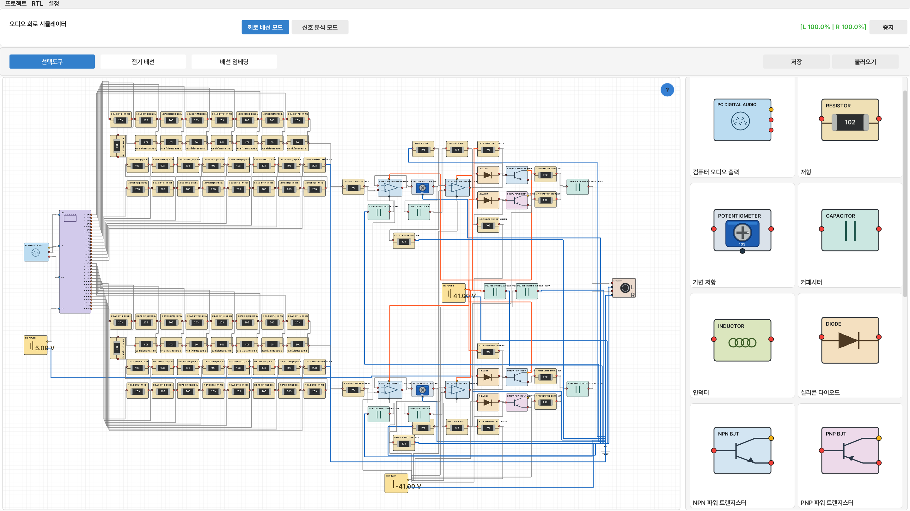
> **物理ベースのMNA解析、リアルタイムWindowsオーディオルーティング、Verilog/RTLコンポーネントを統合したリアルタイム・オーディオ回路シミュレータです。**


**Audio Circuit Simulator**は、オーディオ信号経路を視覚的に構成し、実際のオーディオをその回路へリアルタイムに通すことができるデスクトップ回路シミュレーション環境です。

このプロジェクトは、通常は別々のツールに分かれている3つの領域を1つに統合しています。

- ビジュアル回路エディタ
- 物理ベースのオーディオ／電気回路解析エンジン
- Verilog/RTL開発・ランタイム環境

単なる回路図ビューアではありません。Windowsの再生オーディオを入力として取得し、Verilog DACモデルを通過させ、接続されたアナログ回路をオーディオサンプルレートで解析したうえで、スピーカー／ヘッドホンの負荷モデルを駆動できます。同時に、RMS、FFT、THD、THD+N、SNR、DCオフセット、電力、温度、周波数応答などの測定値をリアルタイムで確認できます。

---

## 主な機能

### リアルタイム物理回路シミュレーション
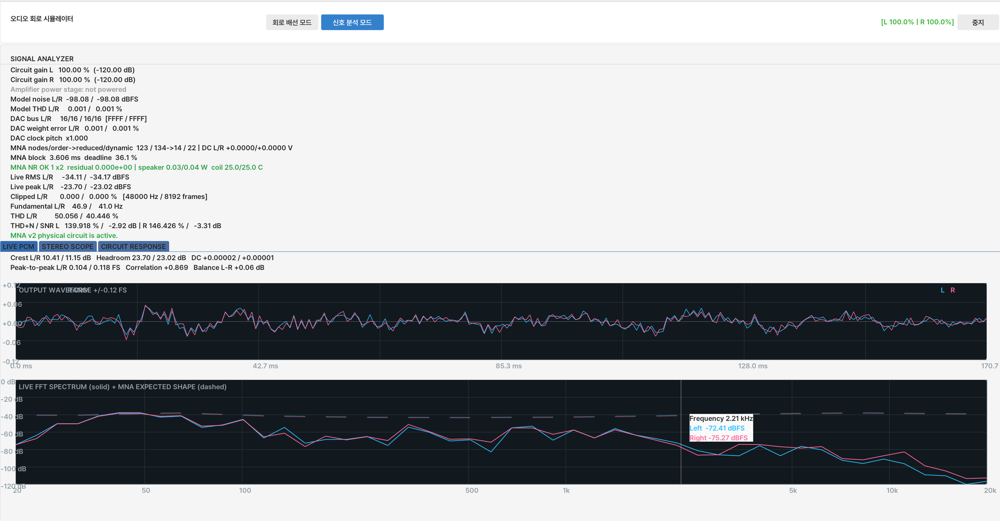
アナログエンジンは**Modified Nodal Analysis（MNA）**をベースとしており、DC、過渡応答、AC応答の計算に対応しています。

実装されている電気モデルは次のとおりです。

- 公差および熱雑音の影響を含む抵抗
- 可変抵抗
- ESR、漏れ、定格電圧を含むコンデンサ
- DCRおよび飽和電流パラメータを含むインダクタ
- シリコンダイオード
- NPNおよびPNP BJTの非線形モデル
- オペアンプ
- DC、AC、パルス電源
- ステレオスピーカー／トランスデューサ負荷
- アナロググラウンドおよびリターン経路

非線形回路ではNewton反復を実行し、収束状態、残差誤差、非線形サブステップ、失敗に関連するコンポーネントを追跡します。

リアルタイム処理経路では、抵抗のみで構成された内部ノードを厳密に縮約する処理も使用します。これにより、すべてのノード電圧結果を維持したまま、各サンプルで解く必要がある行列サイズを削減できます。

### シミュレーション回路を通したWindowsオーディオ処理
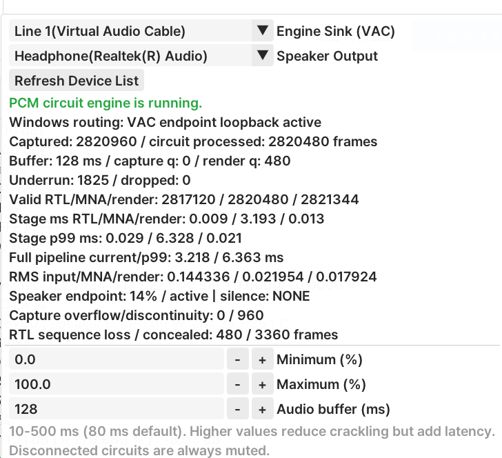

アプリケーションには専用の**WASAPIキャプチャ／処理／レンダーブリッジ**が含まれています。

一般的な信号フローは次のとおりです。

```text
Windows playback
      │
      ▼
Virtual Audio Cable
      │  WASAPI loopback capture
      ▼
Audio Circuit Simulator
      │
      ├─ RTL / DAC processing
      ├─ physical MNA circuit processing
      └─ live signal analysis
      │
      ▼
Selected Windows output device
      │
      ▼
Speakers / headphones
```

このブリッジは、48 kHzステレオ浮動小数点オーディオ、イベント駆動WASAPI共有モードストリーム、バッファリング、シーケンス追跡、アンダーラン／ドロップ統計、出力エンドポイント監視を使用します。

ルーティングを有効にすると、アプリケーションはWindowsの再生出力を一時的にVirtual Audio Cableへ切り替え、処理停止時に以前のデフォルト出力デバイスへ復元します。

### Verilog / RTLコンポーネント
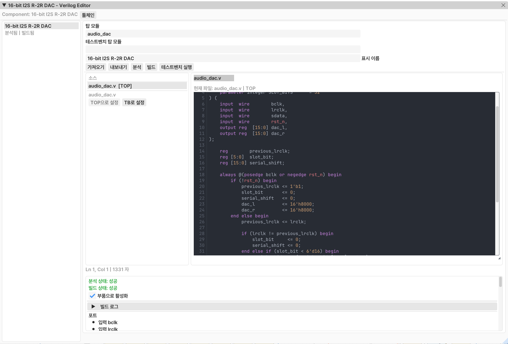

デジタル部品は、固定されたソフトウェアモデルの代わりにVerilogモジュールとして実装できます。

統合RTLワークスペースは次の機能を提供します。

- 複数ファイルのVerilogソース編集
- top module選択
- ソース解析
- Verilatorビルド
- テストベンチ実行
- ビルド／解析診断メッセージ
- テストベンチのPASS / FAIL / TIMEOUTサマリー
- VCD波形の生成およびオープン
- HDLポートに基づくランタイムピンの自動生成
- 再利用可能なRTLコンポーネントのインポート／エクスポート
- 編集可能なソースがなくても実行可能なランタイムアーティファクトのパッケージ化

Windowsでは、RTLコンパイルを**WSL2**経由で実行し、次のツールを使用します。

- Verilator
- `g++`
- `make`

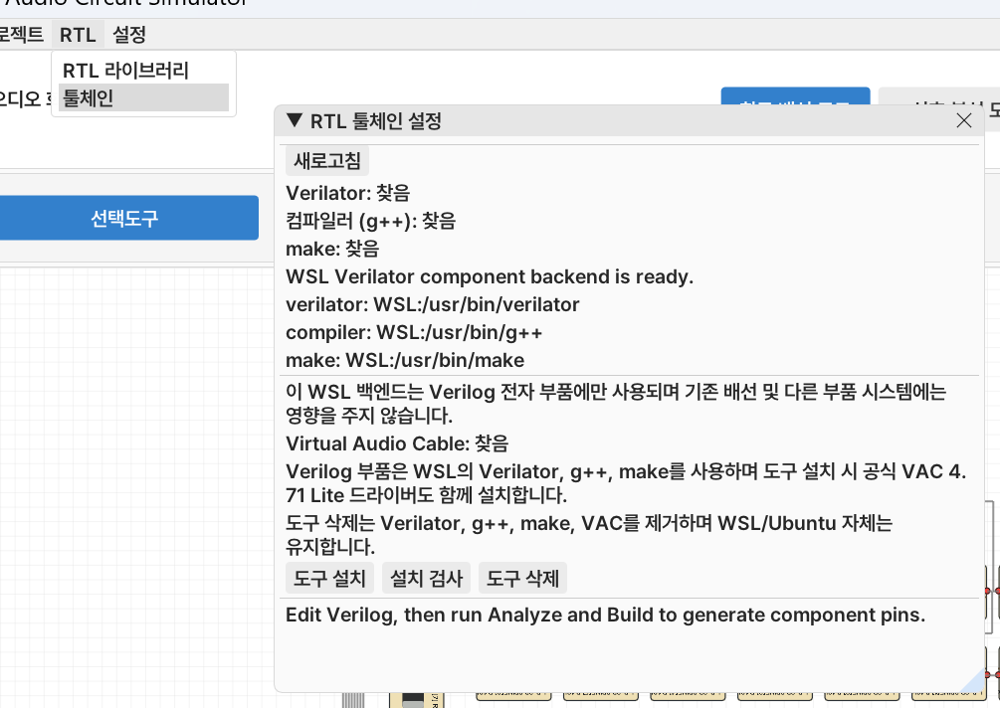

アプリケーションの**Install Tools**機能を使用すると、WSL環境と必要なパッケージを準備できます。リアルタイムオーディオブリッジに必要なVirtual Audio Cableもアプリケーションからインストールできます。

### 内蔵シグナルアナライザ
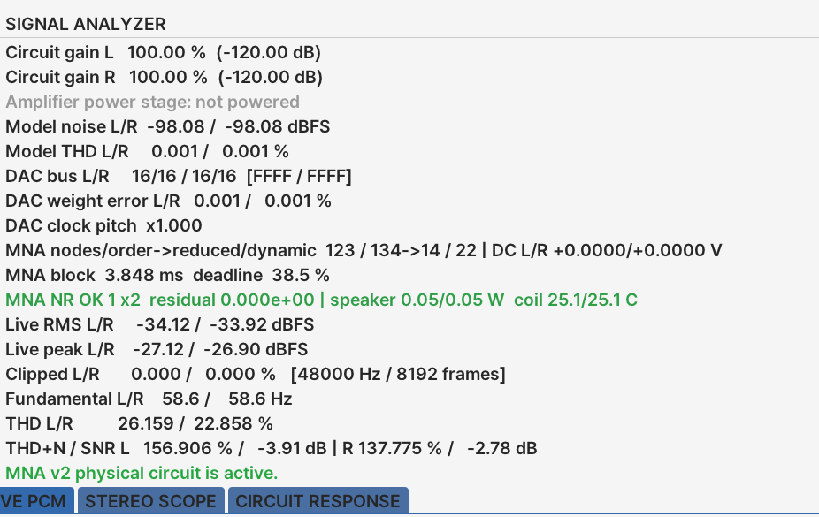

Signal Analysis画面では、モデルベースのデータと実際のPCM測定データの両方を表示します。

#### リアルタイムPCM測定
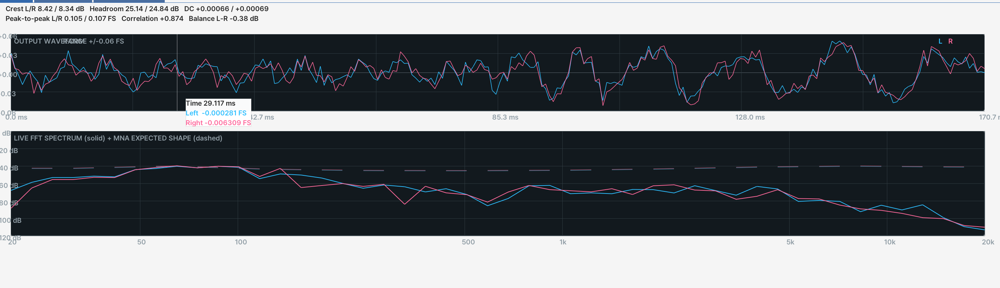

- 左／右RMS（dBFS）
- ピークレベル
- クリッピング比率
- 検出された基本周波数
- THD
- THD+N
- SNR
- 波形表示
- リアルタイムスペクトラム / FFT

#### ステレオ解析
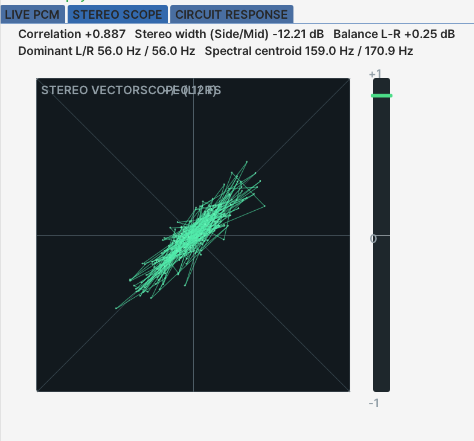

- ステレオベクトルスコープ
- チャンネルバランス
- 相関を中心としたステレオ可視化
- 左／右応答比較

#### 回路レベル測定
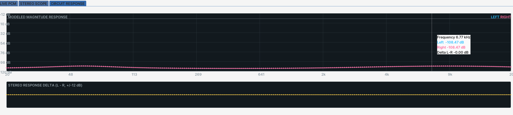

- 回路ゲイン
- モデル化されたノイズフロア
- DACバス接続状態
- DACビット重み誤差
- DACクロック／ピッチ比
- アンプ電源電圧および電流制限
- 最大スピーカー電力およびピーク電圧
- DC遮断およびエミッタバラストの安全状態
- 推定DCオフセット
- スピーカー電力
- ボイスコイル温度
- MNAノード／行列サイズ
- 縮約後の行列次数
- Newton反復回数
- 残差誤差
- 処理時間およびリアルタイムデッドライン使用率
- 高解像度周波数応答
- 左／右応答差

### ビジュアル回路エディタ
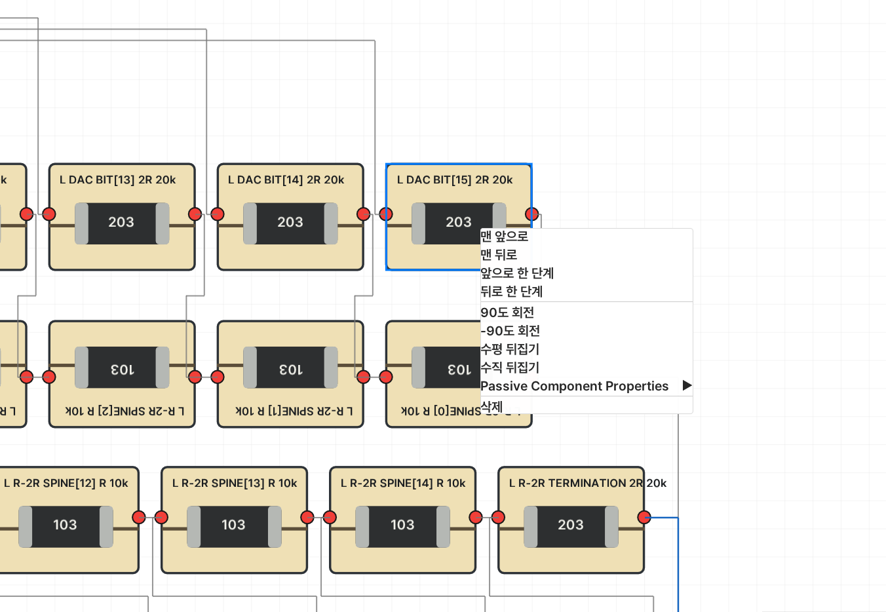

エディタは次の機能に対応しています。

- ドラッグ＆ドロップによるコンポーネント配置
- 電気配線
- ワイヤラベル／タグ
- グリッドおよびポートスナップ
- ズーム／パン
- コンポーネント回転
- 水平／垂直反転
- Z-order制御
- コンポーネントパラメータ編集
- プロジェクト保存／読み込み

UIは**英語、韓国語、日本語**に対応しています。

---

## オーディオコンポーネント

| 分類 | コンポーネント |
| --- | --- |
| 信号 / 変換 | Computer Audio Output, DAC |
| 受動素子 | Resistor, Potentiometer, Capacitor, Inductor |
| 半導体 | Silicon Diode, NPN BJT, PNP BJT, Operational Amplifier |
| 電源 | DC Power Supply, AC / EQ Sweep, Pulse Generator |
| 出力 | Stereo Speaker / transducer load |
| 基準 | Audio Ground |
| カスタムデジタルロジック | Verilog RTL Module |

多くのモデルでは、理想化された教科書モデルだけでなく、非理想パラメータも設定できます。たとえば、抵抗公差、コンデンサESR／漏れ、トランジスタbetaと熱限界、OP-AMPのGBW／スルーレート／電流制限、詳細なスピーカー電気機械パラメータなどを設定できます。

---

## アーキテクチャ

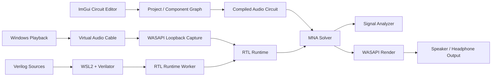

### 主なソース領域

```text
src/
├─ application/      UI coordination, project interaction, RTL editor
├─ audio/            real-time audio runtime, MNA integration, WASAPI bridge
├─ components/       visual/electrical component definitions
├─ rtl/              Verilog project manager, WSL toolchain, runtime worker
├─ wiring/           circuit-canvas wiring and snapping
└─ project/          project serialization and package handling

tests/               solver and real-time audio regression tests
examples/            ready-to-load reference/fault/profile projects
resources/           fonts, translations, icons, themes
```

独立した`audio_engine_core`ライブラリには、ソルバと接続されるオーディオエンジンが含まれており、自動テストから直接使用されます。

---

## プロジェクトファイル

プロジェクトは**`.acproj`パッケージ**として保存されます。

パッケージには、回路レイアウト、オーディオパラメータ、RTLライブラリメタデータ、コンパイル済みRTLランタイムアーティファクトを含めることができます。これにより、サンプルや共有プロジェクトを特定PCのローカルビルドキャッシュに依存しない自己完結型として保持できます。

---

## 収録サンプル

リポジトリには、正常動作と現実的な故障特性の両方を確認できる複数のプロジェクトが含まれています。

| プロジェクト | 目的 |
| --- | --- |
| `CompleteStereoVolume.acproj` | 16-bit DAC、再構成フィルタ、ボリューム制御、Class-AB出力段、スピーカー負荷を含む完全なステレオ基準経路 |
| `Fault01_BitWeightDAC.acproj` | DACのビット順序／重み誤差によるコード非線形性と高調波歪み |
| `Fault02_StereoFilterChaos.acproj` | 左／右再構成フィルタの大きな不一致 |
| `Fault03_BrownoutClipper.acproj` | 不十分な電源レールによる電圧／電流制限とクリッピング |
| `Fault04_ThermalDcHazard.acproj` | スピーカーへDCオフセットが到達し、発熱リスクを生む状況 |
| `Fault05_CrossoverBandwidth.acproj` | 制限されたドライバ帯域幅／スルー特性とクロスオーバーに関連する歪み |
| `Effect06_ExtremePitchClock.acproj` | 意図的なDACクロック不一致によって再生速度とピッチが変化する効果 |
| `Profile07_ATH_M50x.acproj` | 低電圧ドライバを含むヘッドホン向け応答／負荷プロファイル |

サンプルを読み込み、シミュレーションを開始して、**LIVE PCM**、**STEREO SCOPE**、**CIRCUIT RESPONSE**を比較してください。

---

## 必要環境

### メインアプリケーション

- Windows 10/11 x64
- CMake **3.20+**
- C++20コンパイラ
  - Visual Studio 2022 / MSVC、または
  - MinGW-w64
- Git（CMake `FetchContent`で必要）
- OpenGL 3.3対応GPU／ドライバ

アプリケーションが使用するサードパーティC++依存関係は、CMakeが自動的にダウンロードします。

### RTLおよびリアルタイムWindowsオーディオ機能

すべての機能を使用するには、次の環境が必要です。

- LinuxディストリビューションがインストールされたWSL2
- Verilator
- `g++`
- `make`
- Virtual Audio Cable 4.71 Lite

これらのツールは、アプリケーションの**RTL → Toolchain → Install Tools**メニューから準備できます。ドライバまたはWSLの設定中に、Windows管理者権限を求められる場合があります。

Virtual Audio Cableのインストーラはインストール時にベンダーからダウンロードされ、処理を進める前に想定されたSHA-256ハッシュとWindowsコード署名情報を確認します。

---

## ビルド

### 構成

```bash
cmake -S . -B build -DBUILD_TESTING=ON
```

### Releaseビルド

```bash
cmake --build build --config Release -j
```

Visual Studio generatorを使用する場合、実行ファイルは通常次の場所に生成されます。

```text
build/bin/Release/AudioCircuitSimulator.exe
```

単一構成のMinGW generatorを使用する場合、通常は次の場所に生成されます。

```text
build/bin/AudioCircuitSimulator.exe
```

UIに必要なリソースは、ビルドシステムによって実行ファイルの隣へコピーされます。

---

## テスト実行

```bash
ctest --test-dir build -C Release --output-on-failure
```

現在のテストスイートは次の領域を含みます。

- DC電圧分圧回路解析
- RC AC応答
- RC過渡安定化
- 制御電源動作
- 物理負荷配線
- アロケーションなしのSPSCオーディオバッファリング
- ADC量子化およびクリッピング
- 16-bit R-2R単調性およびDNL特性
- リアルタイムソルバ処理予算チェック
- 非線形ダイオード収束
- 非線形リアルタイム性能
- BJTバイアス／Early effect動作
- スピーカーインピーダンス共振
- 収録された故障プロジェクトの動作
- ATH-M50xプロファイルのリアルタイム処理

---

## パッケージング

CMake/CPackは、Windowsインストーラとポータブル圧縮パッケージの両方を生成するよう構成されています。

```bash
cmake --install build --config Release --prefix dist
cpack --config build/CPackConfig.cmake -C Release
```

Windowsで設定されているパッケージgeneratorは次のとおりです。

- NSIS installer
- ZIP archive

---

## リアルタイム処理の設計メモ

オーディオ処理はUIよりもはるかに厳しい時間制約を受けます。そのため、このプロジェクトでは開発ビルドでも可能な範囲でソルバおよびオーディオ／RTL処理経路を最適化された状態に保ちます。

ランタイムでは次の項目を追跡します。

- キャプチャおよびレンダーフレーム数
- キュー深度
- アンダーランおよびドロップフレーム
- キャプチャ不連続
- RTLシーケンス損失
- RTL処理時間
- MNA処理時間
- 全体処理遅延
- p99タイミング統計
- レンダータイミング
- 無音／失敗原因

これらの計測により、リアルタイムのグリッチが原因不明の無音としてしか現れない状態を避け、性能問題を直接観察・解析できます。

---

## ライセンス

このプロジェクトは**GNU General Public License v3.0**の下で配布されます。ライセンス全文は[`LICENSE`](LICENSE)を参照してください。
