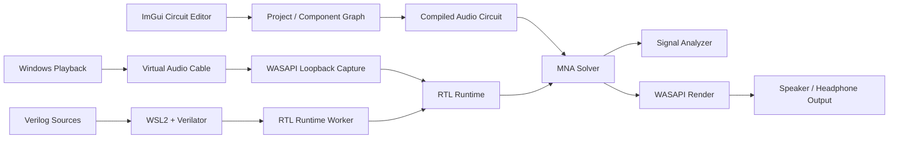

[English](README.md) | **한국어** | [日本語](README_JP.md)

# Audio Circuit Simulator

> **물리 기반 MNA 해석, 실시간 Windows 오디오 라우팅, Verilog/RTL 컴포넌트를 결합한 실시간 오디오 회로 시뮬레이터입니다.**


**Audio Circuit Simulator**는 오디오 신호 경로를 시각적으로 구성하고, 실제 오디오를 해당 회로에 실시간으로 통과시킬 수 있는 데스크톱 회로 시뮬레이션 환경입니다.

이 프로젝트는 일반적으로 서로 다른 도구로 분리되어 있는 세 가지 영역을 하나로 결합합니다.

- 시각적 회로 편집기
- 물리 기반 오디오/전기 회로 해석기
- Verilog/RTL 개발 및 런타임 환경

단순한 회로도 뷰어가 아닙니다. Windows 재생 오디오를 입력으로 받아 Verilog DAC 모델을 통과시키고, 연결된 아날로그 회로를 오디오 샘플 속도로 해석한 뒤, 스피커/헤드폰 부하 모델을 구동할 수 있습니다. 동시에 RMS, FFT, THD, THD+N, SNR, DC 오프셋, 전력, 온도, 주파수 응답과 같은 측정값을 실시간으로 확인할 수 있습니다.

---

## 주요 기능

### 실시간 물리 회로 시뮬레이션

아날로그 엔진은 **Modified Nodal Analysis(MNA)** 기반이며 DC, 과도 응답, AC 응답 계산을 지원합니다.

구현된 전기 모델은 다음과 같습니다.

- 공차와 열잡음 영향을 포함한 저항
- 가변저항
- ESR, 누설, 정격 전압을 포함한 커패시터
- DCR과 포화 전류 파라미터를 포함한 인덕터
- 실리콘 다이오드
- NPN 및 PNP BJT 비선형 모델
- 연산증폭기
- DC, AC, 펄스 전원
- 스테레오 스피커/트랜스듀서 부하
- 아날로그 그라운드 및 리턴 경로

비선형 회로에서는 Newton 반복을 수행하며 수렴 여부, 잔차 오차, 비선형 서브스텝, 실패와 연관된 컴포넌트를 추적합니다.

실시간 처리 경로에서는 저항으로만 이루어진 내부 노드를 정확하게 축약하는 방식도 사용합니다. 이를 통해 전체 노드 전압 결과는 유지하면서 샘플마다 풀어야 하는 행렬 크기를 줄일 수 있습니다.

### 시뮬레이션 회로를 통한 Windows 오디오 처리


애플리케이션에는 전용 **WASAPI 캡처/처리/렌더 브리지**가 포함되어 있습니다.

일반적인 신호 흐름은 다음과 같습니다.

```text
Windows playback
      │
      ▼
Virtual Audio Cable
      │  WASAPI loopback capture
      ▼
Audio Circuit Simulator
      │
      ├─ RTL / DAC processing
      ├─ physical MNA circuit processing
      └─ live signal analysis
      │
      ▼
Selected Windows output device
      │
      ▼
Speakers / headphones
```

브리지는 48 kHz 스테레오 부동소수점 오디오, 이벤트 기반 WASAPI 공유 모드 스트림, 버퍼링, 시퀀스 추적, 언더런/드롭 통계, 출력 엔드포인트 모니터링을 사용합니다.

라우팅이 활성화되면 애플리케이션이 Windows 재생 출력을 가상 오디오 케이블로 임시 전환하고, 처리가 중지되면 이전 기본 출력 장치로 복구합니다.

### Verilog / RTL 컴포넌트


디지털 부품은 고정된 소프트웨어 모델 대신 Verilog 모듈로 구현할 수 있습니다.

통합 RTL 작업 공간은 다음 기능을 제공합니다.

- 다중 파일 Verilog 소스 편집
- top module 선택
- 소스 분석
- Verilator 빌드
- 테스트벤치 실행
- 빌드/분석 진단 메시지
- 테스트벤치 PASS / FAIL / TIMEOUT 요약
- VCD 파형 생성 및 열기
- HDL 포트 기반 런타임 핀 자동 생성
- 재사용 가능한 RTL 컴포넌트 가져오기/내보내기
- 편집 가능한 소스가 없어도 실행 가능한 런타임 아티팩트 패키징

Windows에서는 RTL 컴파일을 **WSL2**를 통해 실행하며 다음 도구를 사용합니다.

- Verilator
- `g++`
- `make`


애플리케이션의 **Install Tools** 기능을 사용하면 WSL 환경과 필요한 패키지를 준비할 수 있습니다. 실시간 오디오 브리지에 필요한 Virtual Audio Cable도 함께 설치할 수 있습니다.

### 내장 신호 분석기


Signal Analysis 화면은 모델 기반 데이터와 실제 PCM 측정 데이터를 모두 표시합니다.

#### 실시간 PCM 측정


- 좌/우 RMS(dBFS)
- 피크 레벨
- 클리핑 비율
- 검출된 기본 주파수
- THD
- THD+N
- SNR
- 파형 표시
- 실시간 스펙트럼 / FFT

#### 스테레오 분석


- 스테레오 벡터스코프
- 채널 밸런스
- 상관관계 중심 스테레오 시각화
- 좌/우 응답 비교

#### 회로 수준 측정


- 회로 이득
- 모델링된 노이즈 플로어
- DAC 버스 연결 상태
- DAC 비트 가중치 오차
- DAC 클럭/피치 비율
- 증폭기 전원 전압 및 전류 제한
- 최대 스피커 전력 및 피크 전압
- DC 차단 및 이미터 밸러스트 안전 상태
- 추정 DC 오프셋
- 스피커 전력
- 보이스 코일 온도
- MNA 노드/행렬 크기
- 축약된 행렬 차수
- Newton 반복 횟수
- 잔차 오차
- 처리 시간 및 실시간 데드라인 사용률
- 고해상도 주파수 응답
- 좌/우 응답 차이

### 시각적 회로 편집기


편집기는 다음 기능을 지원합니다.

- 드래그 앤 드롭 컴포넌트 배치
- 전기 배선
- 와이어 라벨/태그
- 그리드 및 포트 스냅
- 확대/축소 및 이동
- 컴포넌트 회전
- 수평/수직 뒤집기
- Z-order 제어
- 컴포넌트 파라미터 편집
- 프로젝트 저장/불러오기

UI는 **영어, 한국어, 일본어**를 지원합니다.

---

## 오디오 컴포넌트

| 분류 | 컴포넌트                                               |
| --- |--------------------------------------------------------|
| 신호 / 변환 | Computer Audio Output, DAC                             |
| 수동소자 | Resistor, Potentiometer, Capacitor, Inductor           |
| 반도체 | Silicon Diode, NPN BJT, PNP BJT, Operational Amplifier |
| 전원 | DC Power Supply, AC / EQ Sweep, Pulse Generator        |
| 출력 | Stereo Speaker / transducer load                       |
| 기준 | Audio Ground                                           |
| 사용자 정의 디지털 로직 | Verilog RTL Module                                     |

많은 모델은 이상적인 교과서 모델만 사용하는 대신 비이상적 파라미터를 노출합니다. 예를 들어 저항 공차, 커패시터 ESR/누설, 트랜지스터 beta와 열 한계, OP-AMP GBW/슬루율/전류 제한, 상세한 스피커 전기기계 파라미터 등을 설정할 수 있습니다.

---

## 아키텍처



### 주요 소스 영역

```text
src/
├─ application/      UI 조정, 프로젝트 상호작용, RTL 편집기
├─ audio/            실시간 오디오 런타임, MNA 통합, WASAPI 브리지
├─ components/       시각적/전기적 컴포넌트 정의
├─ rtl/              Verilog 프로젝트 관리자, WSL 툴체인, 런타임 워커
├─ wiring/           회로 캔버스 배선 및 스냅
└─ project/          프로젝트 직렬화 및 패키지 처리

tests/               솔버 및 실시간 오디오 회귀 테스트
examples/            바로 불러올 수 있는 기준/고장/프로파일 프로젝트
resources/           폰트, 번역, 아이콘, 테마
```

독립적인 `audio_engine_core` 라이브러리는 솔버와 연결되는 오디오 엔진을 포함하며 자동화 테스트에서 직접 사용됩니다.

---

## 프로젝트 파일

프로젝트는 **`.acproj` 패키지**로 저장됩니다.

패키지에는 회로 배치, 오디오 파라미터, RTL 라이브러리 메타데이터, 컴파일된 RTL 런타임 아티팩트가 포함될 수 있습니다. 따라서 예제나 공유 프로젝트를 특정 PC의 로컬 빌드 캐시에 의존하지 않는 자체 포함형 형태로 유지할 수 있습니다.

---

## 포함된 예제

저장소에는 정상 동작과 현실적인 고장 특성을 모두 확인할 수 있는 여러 프로젝트가 포함되어 있습니다.

| 프로젝트 | 목적 |
| --- | --- |
| `CompleteStereoVolume.acproj` | 16-bit DAC, 재구성 필터, 볼륨 제어, Class-AB 출력단, 스피커 부하를 포함한 전체 스테레오 기준 경로 |
| `Fault01_BitWeightDAC.acproj` | DAC 비트 순서/가중치 오류로 인한 코드 비선형성과 고조파 왜곡 |
| `Fault02_StereoFilterChaos.acproj` | 좌/우 재구성 필터의 큰 불일치 |
| `Fault03_BrownoutClipper.acproj` | 부족한 전원 레일로 인한 전압/전류 제한 및 클리핑 |
| `Fault04_ThermalDcHazard.acproj` | 스피커에 DC 오프셋이 도달하여 발열 위험을 만드는 상황 |
| `Fault05_CrossoverBandwidth.acproj` | 제한된 드라이버 대역폭/슬루 특성과 크로스오버 관련 왜곡 |
| `Effect06_ExtremePitchClock.acproj` | 의도적인 DAC 클럭 불일치로 재생 속도와 피치가 변하는 효과 |
| `Profile07_ATH_M50x.acproj` | 저전압 드라이버를 포함한 헤드폰 지향 응답/부하 프로파일 |

예제를 불러온 뒤 시뮬레이션을 시작하고 **LIVE PCM**, **STEREO SCOPE**, **CIRCUIT RESPONSE**를 비교해 보십시오.

---

## 요구 사항

### 메인 애플리케이션

- Windows 10/11 x64
- CMake **3.20+**
- C++20 컴파일러
  - Visual Studio 2022 / MSVC 또는
  - MinGW-w64
- Git, CMake `FetchContent`에 필요
- OpenGL 3.3 지원 GPU/드라이버

애플리케이션에서 사용하는 서드파티 C++ 의존성은 CMake가 자동으로 다운로드합니다.

### RTL 및 실시간 Windows 오디오 기능

전체 기능을 사용하려면 다음이 필요합니다.

- Linux 배포판이 설치된 WSL2
- Verilator
- `g++`
- `make`
- Virtual Audio Cable 4.71 Lite

이 도구들은 애플리케이션의 **RTL → Toolchain → Install Tools** 메뉴에서 준비할 수 있습니다. 드라이버 또는 WSL 설정 과정에서 Windows 관리자 권한 요청이 나타날 수 있습니다.

Virtual Audio Cable 설치 프로그램은 설치 시 공급업체에서 다운로드되며, 설치를 진행하기 전에 예상 SHA-256 해시와 Windows 코드 서명 정보를 확인합니다.

---

## 빌드

### 구성

```bash
cmake -S . -B build -DBUILD_TESTING=ON
```

### Release 빌드

```bash
cmake --build build --config Release -j
```

Visual Studio generator를 사용하는 경우 실행 파일은 일반적으로 다음 위치에 생성됩니다.

```text
build/bin/Release/AudioCircuitSimulator.exe
```

단일 구성 MinGW generator를 사용하는 경우 일반적으로 다음 위치에 생성됩니다.

```text
build/bin/AudioCircuitSimulator.exe
```

UI에 필요한 리소스는 빌드 시스템이 실행 파일 옆으로 복사합니다.

---

## 테스트 실행

```bash
ctest --test-dir build -C Release --output-on-failure
```

현재 테스트 스위트는 다음 영역을 포함합니다.

- DC 전압 분배기 해석
- RC AC 응답
- RC 과도 안정화
- 제어 전원 동작
- 물리 부하 배선
- 할당 없는 SPSC 오디오 버퍼링
- ADC 양자화 및 클리핑
- 16-bit R-2R 단조성 및 DNL 특성
- 실시간 솔버 처리 예산 검사
- 비선형 다이오드 수렴
- 비선형 실시간 성능
- BJT 바이어스/Early effect 동작
- 스피커 임피던스 공진
- 포함된 고장 프로젝트 동작
- ATH-M50x 프로파일의 실시간 처리

---

## 패키징

CMake/CPack은 Windows 설치 프로그램과 포터블 압축 패키지를 생성하도록 구성되어 있습니다.

```bash
cmake --install build --config Release --prefix dist
cpack --config build/CPackConfig.cmake -C Release
```

Windows에서 설정된 패키지 generator는 다음과 같습니다.

- NSIS installer
- ZIP archive

---

## 실시간 처리 설계 참고

오디오 처리는 UI보다 훨씬 엄격한 시간 제약을 가집니다. 따라서 프로젝트는 개발 빌드에서도 가능한 범위에서 솔버와 오디오/RTL 처리 경로를 최적화된 상태로 유지합니다.

런타임에서는 다음 항목을 추적합니다.

- 캡처 및 렌더 프레임 수
- 큐 깊이
- 언더런 및 드롭 프레임
- 캡처 불연속
- RTL 시퀀스 손실
- RTL 처리 시간
- MNA 처리 시간
- 전체 처리 지연
- p99 타이밍 통계
- 렌더 타이밍
- 무음/실패 원인

이러한 계측을 통해 실시간 글리치가 원인을 알 수 없는 무음으로만 나타나지 않고, 성능 문제를 직접 관찰하고 분석할 수 있습니다.

---

## 라이선스

이 프로젝트는 **GNU General Public License v3.0**으로 배포됩니다. 전체 라이선스 내용은 [`LICENSE`](LICENSE)를 확인하십시오.
